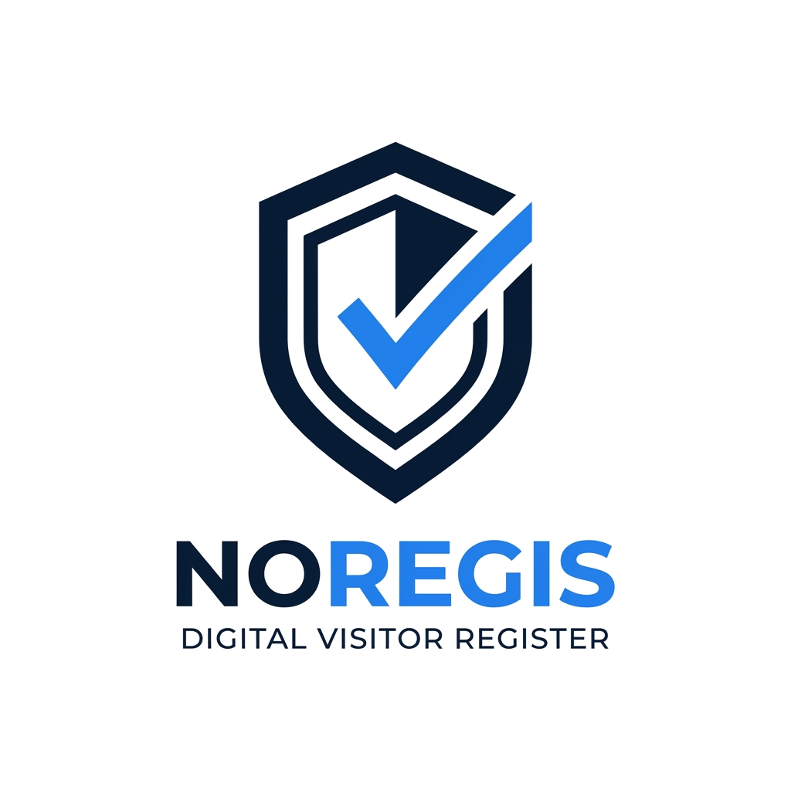

# 🛡️ NoRegis — Registre Digital des Visiteurs & Contrôle d'Accès Intelligent



**NoRegis** est une plateforme moderne, temps réel et intelligente dédiée à la gestion, la sécurisation et la traçabilité des entrées/sorties des visiteurs et des véhicules au sein des entreprises, institutions et sites sensibles.

---

## ✨ Fonctionnalités Principales

### 🔄 1. Scan Intelligent Recto / Verso (IA & OCR)
* **Flux guidé en 2 étapes** :
  * **Face 1 (Recto)** : Extraction automatique du Nom, Prénom, Numéro de pièce, Sexe, Date et Lieu de naissance.
  * **Face 2 (Verso)** : Extraction du **NIN** (Numéro d'Identification Nationale sénégalais) et des dates de validité.
* **Option flexible** : Possibilité de passer le verso si la carte n'est pas disponible.
* **Compression adaptative** : Redimensionnement automatique à 1024px et compression JPEG (fichiers ultra-légers de ~150 Ko pour un scan en < 2 secondes).
* **Support Caméra Live & Import Fichier** : Détection avec torche/flash et cadre de visée ajusté.

### 🔴 2. Synchronisation Temps Réel (WebSockets / Socket.IO)
* Mises à jour instantanées sur tous les écrans connectés :
  * Notification et ajout automatique des nouvelles entrées.
  * Pointage des sorties en direct.
  * Synchronisation des suppressions sans rechargement de page.

### 🛡️ 3. Gestion Avancée des Rôles (Admin & Agent)
* **👑 Espace Administrateur** :
  * Tableau de bord analytique et métriques de fréquentation en direct.
  * Répartition par département et pic horaire.
  * Gestion complète des agents (création, activation/désactivation, accréditations).
* **🛡️ Espace Agent de Sécurité / Réception** :
  * Liste des personnes et véhicules actuellement sur site.
  * Pointage de sortie en 1 clic.
  * Bouton Flottant (FAB) d'accès direct au scanner sur tous les écrans.

### 📲 4. QR Code & Badges Personnels
* Génération et téléchargement direct du **QR Code personnel d'accréditation** pour chaque agent depuis son profil.

### 🌍 5. Internationalisation & Ergonomie
* **3 langues intégrées** : Français (FR), Anglais (EN), Arabe (AR).
* **Support RTL natif** : Inversion automatique de l'interface en Arabe.
* **Mode Sombre / Clair** complet et soigné (`Dark Mode`).

---

## 🛠️ Stack Technique

### Frontend
* **Framework** : [React 19](https://react.dev/) + [Vite](https://vitejs.dev/)
* **Styles & UI** : [Tailwind CSS](https://tailwindcss.com/) + [Lucide Icons](https://lucide.dev/)
* **Routage** : [React Router v7](https://reactrouter.com/)
* **Temps Réel** : [Socket.IO Client](https://socket.io/)
* **QR Codes** : [QRCode](https://github.com/soldair/node-qrcode)

### Backend
* **API** : [Node.js](https://nodejs.org/) / [Express](https://expressjs.com/)
* **Base de données** : [MongoDB Atlas](https://www.mongodb.com/atlas) via Mongoose
* **Vision & IA** : [Google Gemini Vision API](https://ai.google.dev/) + OCR Veryfi

---

## 📁 Structure du Projet

```text
noregis/
├── public/                  # Manifest PWA, Favicons et assets publics
├── src/
│   ├── assets/              # Logos et images du projet
│   ├── components/          # Composants réutilisables
│   │   ├── Layout.jsx       # Layout global (Sidebar, TopBar, BottomNav, FAB)
│   │   ├── RegistrationModal.jsx # Formulaire d'enregistrement avec scan
│   │   ├── ScanPanel.jsx    # Moteur de scan Recto/Verso avec LiveCamera
│   │   ├── VisitorTable.jsx # Tableau dynamique des passages
│   │   ├── VisitorDetail.jsx# Fiche détaillée visiteur (avec NIN)
│   │   └── UI.jsx           # Composants atomiques (Boutons, Badges, Modales)
│   ├── context/             # Gestion globale de l'état (Context API + Reducers)
│   ├── pages/               # Vues de l'application
│   │   ├── admin/           # Dashboard Admin et Gestion des Agents
│   │   ├── agent/           # Dashboard Agent et Historique
│   │   ├── Login.jsx        # Authentification sécurisée
│   │   ├── PublicScan.jsx   # Borne publique sans authentification
│   │   └── Settings.jsx     # Paramètres et Profil Agent
│   ├── services/            # Couche API et WebSockets
│   │   ├── api.js           # Client HTTP (GET, POST, PUT, DELETE)
│   │   ├── authService.js   # Authentification et gestion des comptes
│   │   ├── socketService.js # Connexion WebSockets Socket.IO
│   │   ├── visitService.js  # Gestion des visites (entrées/sorties)
│   │   ├── visitorService.js# Gestion des visiteurs
│   │   └── scanPublicService.js # Scan kiosque sans token
│   └── translations.js      # Dictionnaire multilingue (FR, EN, AR)
├── .env                     # Variables d'environnement
├── package.json
└── vite.config.js
```

---

## 🚀 Installation & Démarrage

### 1. Cloner le projet
```bash
git clone https://github.com/mmilinda/noregis.git
cd noregis
```

### 2. Installer les dépendances
```bash
npm install
```

### 3. Configurer l'environnement (`.env`)
Créez un fichier `.env` à la racine :
```env
VITE_API_URL=https://noregisbackend-h9l7.onrender.com
```

### 4. Lancer en développement
```bash
npm run dev
```

### 5. Compiler pour la production
```bash
npm run build
```

---

## 👤 Auteur & Maintenance

* **Auteur** : [Milinda MENDY](mailto:mmilinda00@gmail.com)
* **Dépôt Frontend** : [github.com/mmilinda/noregis](https://github.com/mmilinda/noregis)
* **Dépôt Backend** : [github.com/mmilinda/noregisbackend](https://github.com/mmilinda/noregisbackend)

